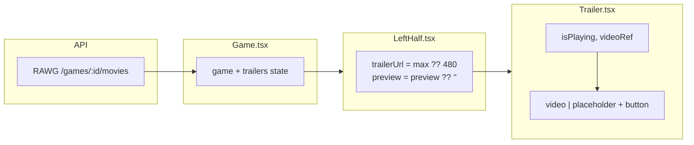

# `Trailer` component (watch trailer — video + overlay)

**Location:** `client/src/Pages/Game/Trailer.tsx`  
**Stack:** React + TypeScript + Tailwind CSS + Lucide `PlayIcon`  
**Purpose:** Render the 16:9 trailer region: optional **`<video>`** with native controls, a **placeholder panel** when there is no URL, and a **centered overlay** (play icon or “Trailer Unavailable”). **Playback UI state** (`isPlaying`, `videoRef`) is **encapsulated here**, not in `LeftHalf`.

For how **`trailerUrl`** and **`preview`** reach this component, see the parent composition in [`lefthalf.md`](./lefthalf.md).

---

## 1. Data flow from `Game` → `LeftHalf` → `Trailer`

RAWG returns **movies** on `GET /games/{id}/movies`; the client maps them to `RawgGameMovie[]`. The game page loads **`game`** and **`trailers`** in parallel; **`LeftHalf`** picks the **first** trailer’s URLs and passes **strings** into **`Trailer`**.



**Why `LeftHalf` passes `trailerUrl` + `preview` instead of `trailers[]`**

- **`Trailer`** stays focused on **presentation + playback** (one trailer slot).
- The parent owns the **policy** “use first movie, prefer `max` then `480`” in one place.
- **`Trailer`** does not import `RawgGameMovie`; props are plain **strings**, which keeps the component easy to test and reuse.

---

## 2. Props and types

```tsx
type TrailerProps = {
    trailerUrl: string;
    preview: string;
};
```

| Prop | Meaning |
|------|---------|
| `trailerUrl` | Resolved video URL (`data["max"] ?? data["480"]` from parent). **Falsy** (`""`) means no playable source. |
| `preview` | Poster image URL for the `<video>` `poster` attribute; may be `""`. |

At runtime, **`LeftHalf`** builds these from optional chaining; if there is no usable URL, **`trailerUrl`** is typically **`""`** or otherwise falsy so the **`trailerUrl ? … : …`** branches choose the **unavailable** UI.

---

## 3. Local React state and ref (owned inside `Trailer`)

```tsx
const [isPlaying, setIsPlaying] = useState(false);
const videoRef = useRef<HTMLVideoElement>(null);
```

| Piece | Role |
|-------|------|
| `isPlaying` | Drives whether the **overlay** is visible (`!isPlaying` shows the button). |
| `videoRef` | Imperative **`videoRef.current?.play()`** when the user clicks the overlay (only when `trailerUrl` is truthy). |

**Synchronization with the real `<video>` element:**

```tsx
onPlay={() => setIsPlaying(true)}
onPause={() => setIsPlaying(false)}
onEnded={() => setIsPlaying(false)}
```

So when the user uses **native controls** to play/pause/stop, the overlay stays in sync.

---

## 4. Visual structure (JSX tree)

```txt
Trailer
└── div.group.relative.aspect-video …    ← 16:9 frame; `group` for hover on children
    └── <> (fragment)
        ├── [trailerUrl] video             ← full-bleed player (`w-full h-full object-cover`)
        │       OR
        │   div.absolute.inset-0           ← dark slab when no URL
        └── [ !isPlaying ] button          ← centered overlay
                ├── [trailerUrl] div       ← gradient pill (`hidden sm:block`); wraps icon
                │       └── PlayIcon
                └── span (gradient text)   ← “Trailer Unavailable”
```

**ASCII layout (conceptual):**

```txt
┌──────────────────────────────────────────────┐
│  group + relative + aspect-video (16:9)      │
│  ┌──────────────────────────────────────────┐│
│  │ video (object-cover) OR dark placeholder ││
│  │         ┌────────────┐                    ││
│  │         │ btn: pill +│  absolute center  ││
│  │         │   PlayIcon │                    ││
│  │         └────────────┘                    ││
│  └──────────────────────────────────────────┘│
└──────────────────────────────────────────────┘
```

---

## 5. Branching logic (truthy `trailerUrl`)

### A. Video vs placeholder

```tsx
{trailerUrl ? (
    <video
        src={trailerUrl}
        poster={preview || ""}
        className="group w-full h-full object-cover"
        controls
        ref={videoRef}
        onPlay={() => setIsPlaying(true)}
        onPause={() => setIsPlaying(false)}
        onEnded={() => setIsPlaying(false)}
    />
) : (
    <div className="absolute inset-0 bg-slate-900/80" aria-hidden />
)}
```

The extra **`group`** on **`<video>`** is redundant for the overlay (the outer frame already has **`group`**); it can be removed in a cleanup pass without changing hover behavior.

| Branch | What the user sees |
|--------|---------------------|
| **Has URL** | Native `<video>` with poster and controls. |
| **No URL** | Full-area **dark semi-transparent** panel (`bg-slate-900/80`) so the 16:9 area reads as a **distinct surface** vs the parent card gradient (see [`lefthalf.md`](./lefthalf.md) — trailer card shell). |

The placeholder **`div`** is decorative; **`aria-hidden`** avoids extra noise for screen readers — the **button** below still exposes **“Trailer unavailable”** via **`aria-label`** and visible text.

### B. Overlay button (only when `!isPlaying`)

```tsx
{!isPlaying && (
    <button
        type="button"
        className={`absolute top-1/2 left-1/2 -translate-x-1/2 -translate-y-1/2${trailerUrl ? " cursor-pointer" : ""}`}
        onClick={trailerUrl ? () => void videoRef.current?.play() : undefined}
        aria-label={trailerUrl ? "Play trailer" : "Trailer unavailable"}
    >
        {trailerUrl ? (
            <div className="flex items-center justify-center hidden sm:block bg-gradient-to-br from-purple-800/70 via-slate-800/70 to-blue-700/70 rounded-full p-2 group-hover:from-purple-900/80 group-hover:via-slate-900/80 group-hover:to-blue-800/80 transition-all duration-200">
                <PlayIcon
                    className="w-6 h-6 md:w-8 md:h-8 lg:w-10 lg:w-10 text-violet-600 group-hover:text-blue-600 transition-colors duration-450"
                    aria-hidden="true"
                    focusable="false"
                />
            </div>
        ) : (
            <span className="bg-gradient-to-r from-purple-400 to-blue-400 bg-clip-text text-center font-bold text-transparent text-xl sm:text-2xl">
                Trailer Unavailable
            </span>
        )}
    </button>
)}
```

| Condition | Overlay content | `onClick` |
|-----------|-----------------|-----------|
| `trailerUrl` truthy | **Rounded gradient pill** + **`PlayIcon`** (`text-violet-600` → **`group-hover:text-blue-600`** on the SVG; pill gradient stops deepen on **`group-hover`**) | `videoRef.current?.play()` |
| `trailerUrl` falsy | **Gradient text** “Trailer Unavailable” (`text-xl sm:text-2xl`) | `undefined` (not interactive as a play action) |

**`void`** in `void videoRef.current?.play()` discards the `Promise` from `HTMLMediaElement.play()` intentionally (no unhandled promise in strict setups).

**Why `cursor-pointer` is conditional on `trailerUrl`**

- The **outer frame** and **button** add **`cursor-pointer`** only when a playable trailer exists.

**`group` on the outer frame**

- The **`aspect-video`** wrapper uses **`group`** so **`group-hover:`** on the pill and icon fires when the pointer is anywhere over the trailer region (video + overlay), not only on the icon.

**Responsive play affordance**

- The pill + icon use **`hidden sm:block`**: below the **`sm`** breakpoint the centered **button** is still present for accessibility, but the visible pill/icon stack is hidden; narrow layouts may rely on tapping the video / controls (consider a dedicated small-screen treatment if you need a visible play cue on all widths).

---

## 6. Tailwind reference (by layer)

### Outer frame (16:9 + clipping)

| Classes | Effect |
|---------|--------|
| `group` | Hover scope for **`group-hover:`** on the play pill and **`PlayIcon`** when the pointer is over the trailer region. |
| `relative` | Positioning context for **`absolute`** children (placeholder + overlay). |
| `aspect-video` | **16:9** box; height follows width. |
| `overflow-hidden` | Clips video/corners. |
| `rounded-2xl` | Rounded corners aligned with the card. |
| `border border-slate-700/10` | Subtle edge on the player frame. |
| `cursor-pointer` (conditional) | Entire frame shows pointer when a trailer can be played. |

### `<video>`

| Classes | Effect |
|---------|--------|
| `w-full h-full` | Fills the aspect box. |
| `object-cover` | Covers the frame (crop if aspect differs). |
| `group` | Currently present on **`<video>`**; redundant with the outer **`group`** (safe to remove). |

### Placeholder (no URL)

| Classes | Effect |
|---------|--------|
| `absolute inset-0` | Fills the same area the video would. |
| `bg-slate-900/80` | Dark tint; separates from card background. |

### Overlay `button`

| Classes | Effect |
|---------|--------|
| `absolute top-1/2 left-1/2 -translate-x-1/2 -translate-y-1/2` | **Dead-center** in the frame. |
| `cursor-pointer` (conditional) | When **`trailerUrl`** is set. |

### Play pill wrapper (`div` around `PlayIcon`)

| Classes | Effect |
|---------|--------|
| `hidden sm:block` | Pill + icon visible from **`sm`** breakpoint up. |
| `flex items-center justify-center` | Centers the icon in the circle. |
| `bg-gradient-to-br from-purple-800/70 via-slate-800/70 to-blue-700/70` | Default triple-stop gradient. |
| `rounded-full p-2` | Circular chip around the icon. |
| `group-hover:from-purple-900/80 group-hover:via-slate-900/80 group-hover:to-blue-800/80` | Darker / richer stops when the **`.group`** frame is hovered. |
| `transition-all duration-200` | Intended to ease property changes on the pill (gradient stop animation is limited in browsers; **transform** / **opacity** additions would tween more reliably). |

### `PlayIcon` (Lucide SVG)

| Classes | Effect |
|---------|--------|
| `w-6 h-6 md:w-8 md:h-8 lg:w-10 lg:w-10` | Responsive icon size. |
| `text-violet-600` | Default stroke via **`currentColor`**. |
| `group-hover:text-blue-600` | Color shift when the outer **`group`** is hovered. |
| `transition-colors duration-450` | Color transition timing on the icon (use a theme **`duration-*`** token or **`duration-[450ms]`** if **`450`** is not in your Tailwind config). |

### Unavailable copy (`span`)

| Classes | Effect |
|---------|--------|
| `bg-gradient-to-r from-purple-400 to-blue-400` | Gradient “ink.” |
| `bg-clip-text text-transparent` | Clip gradient to text glyphs. |
| `text-center font-bold text-xl sm:text-2xl` | Typography; steps up at **`sm`**. |

---

## 7. Accessibility notes

- **Semantic control:** **`type="button"`** (avoids accidental form submit).
- **Names:** **`aria-label`** switches between **“Play trailer”** and **“Trailer unavailable”**.
- **Decorative icon:** **`aria-hidden`** + **`focusable="false"`** on **`PlayIcon`** so the label carries the name.
- **Unavailable text:** Prefer **`span`** (phrasing) inside **`button`**, not **`p`** (flow), to satisfy HTML **button** content rules.
- **Placeholder `div`:** **`aria-hidden`** because the **`button`** communicates state.

---

## 8. Mental model (state machine)

```txt
                    ┌─────────────┐
                    │  mounted    │
                    └──────┬──────┘
                           │ user plays (overlay or controls)
                           ▼
                    ┌─────────────┐
         isPlaying = true         overlay hidden
                    └──────┬──────┘
                           │ pause / ended
                           ▼
                    ┌─────────────┐
         isPlaying = false        overlay visible (if trailerUrl logic allows)
                    └─────────────┘
```

When **`trailerUrl`** is missing, there is **no** `<video>`; **`isPlaying`** stays **`false`**, so the overlay **can** still show **“Trailer Unavailable”** (same overlay slot, different content).

---

## 9. Related files

| File | Link |
|------|------|
| Parent composition + `trailerUrl` derivation | [`lefthalf.md`](./lefthalf.md) |
| API types / `RawgGameMovie` | `client/src/api/trailers.ts` |
